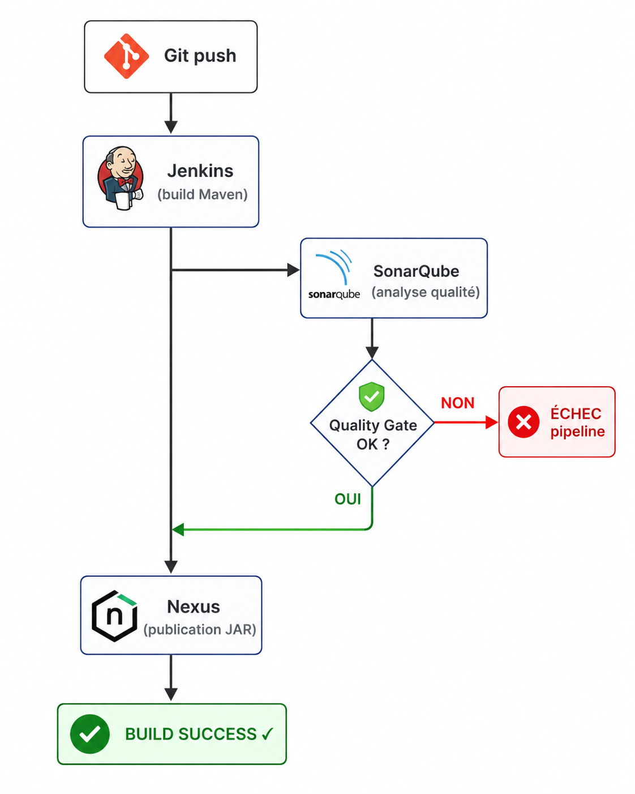

# LAB_NEXUS.md — Expert Artéfact : Sonatype Nexus Repository Manager

<p align="center">
  
</p>

> **Étudiant B — Pilier Artéfact**  
> Environnement : Ubuntu VPS · Docker · Jenkins · Maven · Spring Boot 1.0.1  
> Documentation officielle : https://help.sonatype.com/en/sonatype-nexus-repository.html

---

## 1. Le Besoin — Problématique Métier

### Pourquoi un dépôt privé d'artéfacts ?

Dans un projet professionnel, `mvn package` produit un `.jar`. Sans gestionnaire d'artéfacts, ce fichier :

- **disparaît** à la prochaine compilation (pas de traçabilité de version),
- **circule par e-mail ou clé USB** entre les développeurs (pas sécurisé),
- **est re-téléchargé depuis Internet** à chaque build (lent, fragile, risqué si le dépôt public change).

Nexus Repository Manager résout ces trois problèmes :

| Problème sans Nexus | Solution avec Nexus |
|---|---|
| Pas de traçabilité des versions livrées | Chaque artefact est immutable, versionné, horodaté |
| Dépendances publiques re-téléchargées à chaque build | Cache proxy local → builds hors-ligne possibles |
| Partage de JAR par e-mail/FTP | URL stable, authentification, audit des téléchargements |
| Vulnérabilités dans les libs publiques non détectées | IQ Server (Nexus Lifecycle) peut bloquer les dépendances à risque |

### Schéma d'ensemble

```
Développeur / Jenkins
        │
        │  mvn deploy
        ▼
┌──────────────────────────────────────┐
│         Nexus Repository Manager     │
│                                      │
│  ┌─────────────┐  ┌───────────────┐  │
│  │   Hosted    │  │     Proxy     │  │
│  │  (maven-    │  │  (central,    │  │
│  │  releases)  │  │   jcenter…)   │  │
│  └─────────────┘  └───────────────┘  │
│         ▲               │            │
│         │    ┌──────────┘            │
│         └────┤   Group               │
│              │ (maven-public)        │
│              └───────────────────────┘
│                        │
│            Répond aux mvn install     │
└──────────────────────────────────────┘
```

---

## 2. Les Concepts Clés

### 2.1 Types de Repositories

| Type | Rôle | Exemple d'usage |
|------|------|----------------|
| **Hosted** | Stockage interne des artefacts produits par l'équipe | `maven-releases`, `maven-snapshots` |
| **Proxy** | Miroir cache d'un dépôt distant (Maven Central, etc.) | `maven-central` |
| **Group** | Agrège plusieurs repos en une seule URL | `maven-public` |

### 2.2 Formats supportés

Nexus OSS 3.x supporte nativement : **Maven**, **Docker**, **npm**, **PyPI**, **NuGet**, **Helm**, **Raw**, **Apt**, **Yum**.

Dans ce lab, nous utilisons le format **Maven 2 (MRM)**.

### 2.3 Immuabilité et politique de redéploiement

Un repository `maven-releases` est configuré par défaut avec la politique **Disable Redeploy** : une version `1.0.1` publiée ne peut plus être écrasée. C'est un principe fondamental de traçabilité : *un numéro de version = un artefact figé*.

> 📖 Référence officielle : [Repository Management — Hosted Repositories](https://help.sonatype.com/en/hosted-repositories.html)

### 2.4 Coordonnées Maven (GAV)

Chaque artefact est identifié par un triplet **GAV** :

```
GroupId    : com.reservation
ArtifactId : reservation-system
Version    : 1.0.1
```

Ce qui donne le chemin dans Nexus :
`com/reservation/reservation-system/1.0.1/reservation-system-1.0.1.jar`

---

## 3. Mise en Place Technique

### 3.1 Installation — Nexus via Docker

L'environnement de ce lab utilise Docker. Nexus est lancé avec la commande suivante :

```bash
docker run -d \
  --name nexus \
  -p 8081:8081 \
  -v nexus-data:/nexus-data \
  sonatype/nexus3:latest
```

**Vérification que le conteneur tourne :**

```bash
docker ps --format "table {{.Names}}\t{{.Image}}\t{{.Ports}}"
```

Résultat obtenu sur notre VPS :

```
NAMES     IMAGE                 PORTS
jenkins   jenkins/jenkins:lts   0.0.0.0:8080->8080/tcp, 50000/tcp
nexus     sonatype/nexus3       0.0.0.0:8081->8081/tcp
```

**Récupération du mot de passe initial admin :**

```bash
docker exec nexus cat /nexus-data/admin.password
```

Se connecter sur `http://localhost:8081` → login `admin` → changer le mot de passe → activer l'accès anonyme en lecture (optionnel selon la politique de sécurité).

> 📖 Référence officielle : [Installation — Docker](https://help.sonatype.com/en/docker-container-configuration.html)

### 3.2 Création du Repository Hosted `maven-releases`

Dans l'interface Nexus :

1. **Administration → Repositories → Create repository**
2. Choisir le recipe : `maven2 (hosted)`
3. Paramètres :
   - **Name** : `maven-releases`
   - **Version policy** : `Release`
   - **Deployment policy** : `Disable redeploy`  ← immuabilité
4. Sauvegarder

URL du repository obtenue : `http://localhost:8081/repository/maven-releases/`

### 3.3 Création d'un utilisateur de déploiement

Ne jamais utiliser le compte `admin` dans les pipelines CI.

1. **Administration → Security → Users → Create user**
2. Paramètres :
   - **User ID** : `jenkins-deployer`
   - **Password** : `<mot de passe fort>`
   - **Roles** : `nx-deployment` (ou rôle personnalisé avec `nx-repository-view-maven2-maven-releases-*`)

> 📖 Référence officielle : [Security — Users and Roles](https://help.sonatype.com/en/roles.html)

### 3.4 Configuration Maven (`settings.xml`)

Maven a besoin des credentials pour publier. Ce fichier se place dans `~/.m2/settings.xml` sur le serveur Jenkins (ou injecté via Jenkins Credentials) :

```xml
<settings>
  <servers>
    <server>
      <id>nexus-releases</id>
      <username>jenkins-deployer</username>
      <password>VOTRE_MOT_DE_PASSE</password>
    </server>
  </servers>
</settings>
```

> L'`<id>nexus-releases</id>` doit correspondre exactement à l'id déclaré dans le `pom.xml`.

### 3.5 Configuration `pom.xml`

Le projet doit déclarer la destination de déploiement :

```xml
<distributionManagement>
  <repository>
    <id>nexus-releases</id>
    <url>http://localhost:8081/repository/maven-releases/</url>
  </repository>
  <snapshotRepository>
    <id>nexus-snapshots</id>
    <url>http://localhost:8081/repository/maven-snapshots/</url>
  </snapshotRepository>
</distributionManagement>
```

### 3.6 Credentials Jenkins

Dans Jenkins (`http://localhost:8080`) :

1. **Manage Jenkins → Credentials → Global → Add Credentials**
2. Type : **Username with password**
3. Renseigner :
   - Username : `jenkins-deployer`
   - Password : `<mot de passe>`
   - ID : `nexus-credentials`

Ce credential sera référencé dans le Jenkinsfile via `withCredentials`.

### 3.7 Jenkinsfile — Pipeline de déploiement sur Nexus

```groovy
pipeline {
    agent any

    tools {
        maven 'Maven-3.9'   // Nom configuré dans Jenkins Global Tools
        jdk   'JDK-17'
    }

    environment {
        NEXUS_URL        = 'http://localhost:8081'
        NEXUS_REPO       = 'maven-releases'
        ARTIFACT_ID      = 'reservation-system'
        GROUP_ID         = 'com.reservation'
    }

    stages {

        stage('Checkout') {
            steps {
                checkout scm
            }
        }

        stage('Build & Test') {
            steps {
                dir('backend') {
                    sh 'mvn clean verify'
                }
            }
            post {
                always {
                    junit 'backend/target/surefire-reports/*.xml'
                }
            }
        }

        stage('SonarQube Analysis') {
            // Pilar A — délégué à l'Étudiant A
            steps {
                withSonarQubeEnv('SonarQube') {
                    dir('backend') {
                        sh 'mvn sonar:sonar'
                    }
                }
            }
        }

        stage('Quality Gate') {
            steps {
                timeout(time: 5, unit: 'MINUTES') {
                    waitForQualityGate abortPipeline: true
                }
            }
        }

        stage('Deploy to Nexus') {
            steps {
                // Injection du settings.xml avec les credentials Nexus
                withCredentials([
                    usernamePassword(
                        credentialsId: 'nexus-credentials',
                        usernameVariable: 'NEXUS_USER',
                        passwordVariable: 'NEXUS_PASS'
                    )
                ]) {
                    dir('backend') {
                        sh """
                            mvn deploy \
                              -DskipTests \
                              -Dusername=${NEXUS_USER} \
                              -Dpassword=${NEXUS_PASS} \
                              --settings /var/jenkins_home/.m2/settings.xml
                        """
                    }
                }
            }
        }

    }

    post {
        success {
            echo "✅ Artefact publié sur Nexus : ${NEXUS_URL}/repository/${NEXUS_REPO}/${GROUP_ID.replace('.','/')}/${ARTIFACT_ID}/"
        }
        failure {
            echo "❌ Pipeline échoué. Vérifier le Quality Gate SonarQube ou les logs Maven."
        }
    }
}
```

**Points clés à expliquer ligne par ligne :**

| Ligne / Bloc | Explication |
|---|---|
| `withCredentials` | Injecte les identifiants sans les exposer en clair dans les logs |
| `-DskipTests` | Les tests ont déjà été exécutés au stage `Build & Test` |
| `waitForQualityGate abortPipeline: true` | Si SonarQube refuse la qualité, le deploy ne se fait pas |
| `--settings` | Pointe vers le fichier contenant le `<server>` avec l'id `nexus-releases` |

---

## 4. Test et Validation

### 4.1 Preuve de déploiement réussi (logs réels)

Extrait de la sortie `mvn deploy` exécutée sur notre VPS (`2026-05-15T14:31:44Z`) :

```
Uploading to nexus-releases:
  http://localhost:8081/repository/maven-releases/com/reservation/reservation-system/1.0.1/reservation-system-1.0.1.pom
Uploaded to nexus-releases: ... (4.0 kB at 21 kB/s)

Uploading to nexus-releases:
  http://localhost:8081/repository/maven-releases/com/reservation/reservation-system/1.0.1/reservation-system-1.0.1.jar
Uploaded to nexus-releases: ... (62 MB at 60 MB/s)

Downloading from nexus-releases: .../maven-metadata.xml
Downloaded from nexus-releases: .../maven-metadata.xml (313 B at 3.2 kB/s)
Uploading to nexus-releases: .../maven-metadata.xml
Uploaded to nexus-releases: .../maven-metadata.xml (344 B at 5.8 kB/s)

[INFO] BUILD SUCCESS
[INFO] Total time: 3.351 s
[INFO] Finished at: 2026-05-15T14:31:44Z
```

**Ce que ces logs prouvent :**
1. Le `.pom` (métadonnées) a été uploadé → Nexus connaît les coordonnées GAV.
2. Le `.jar` (62 MB) a été uploadé → l'artefact binaire est stocké.
3. Le `maven-metadata.xml` a été mis à jour → Nexus indexe la nouvelle version `1.0.1`.

### 4.2 Vérification dans l'interface Nexus

Depuis `http://localhost:8081` → **Browse → maven-releases** :

```
com/
 └── reservation/
      └── reservation-system/
           ├── maven-metadata.xml
           └── 1.0.1/
                ├── reservation-system-1.0.1.jar        (62 MB)
                ├── reservation-system-1.0.1.jar.md5
                ├── reservation-system-1.0.1.jar.sha1
                └── reservation-system-1.0.1.pom
```

Les fichiers `.md5` et `.sha1` sont générés automatiquement par Nexus pour garantir l'**intégrité** des téléchargements.

### 4.3 Test de récupération de l'artefact

Pour vérifier qu'un autre projet peut consommer l'artefact stocké :

```xml
<!-- Dans le pom.xml du projet consommateur -->
<dependency>
    <groupId>com.reservation</groupId>
    <artifactId>reservation-system</artifactId>
    <version>1.0.1</version>
</dependency>

<repositories>
    <repository>
        <id>nexus-releases</id>
        <url>http://localhost:8081/repository/maven-releases/</url>
    </repository>
</repositories>
```

```bash
mvn dependency:get \
  -Dartifact=com.reservation:reservation-system:1.0.1 \
  -DremoteRepositories=nexus-releases::::http://localhost:8081/repository/maven-releases/
```

### 4.4 Scénario d'échec — Tentative de re-déploiement

Avec la politique `Disable Redeploy`, tenter de re-publier `1.0.1` retourne :

```
[ERROR] Failed to execute goal org.apache.maven.plugins:maven-deploy-plugin:3.1.1:deploy
[ERROR] Could not transfer artifact ...
[ERROR] 400 Repository does not allow updating assets: maven-releases
```

Ce comportement est **voulu** : il garantit l'immuabilité des releases.  
La solution est d'incrémenter le numéro de version (`1.0.2`) avant de redéployer.

---

## 5. Récapitulatif Architecture Finale

```
Git Push
   │
   ▼
Jenkins Pipeline
   ├── [1] Checkout
   ├── [2] mvn clean verify  ──→  Tests unitaires
   ├── [3] mvn sonar:sonar   ──→  SonarQube (Étudiant A)
   ├── [4] Quality Gate      ──→  BLOQUE si code mauvais
   └── [5] mvn deploy        ──→  Nexus maven-releases
                                        │
                             http://localhost:8081/repository/
                             maven-releases/com/reservation/
                             reservation-system/1.0.1/
```

Le pipeline **échoue** si :
- Les tests unitaires échouent (stage 2)
- Le Quality Gate SonarQube rejette le code (stage 4)

Le pipeline **réussit et publie** uniquement si le code passe les deux contrôles.

---

## 6. Références Officielles

| Sujet | Lien |
|-------|------|
| Documentation principale Nexus 3 | https://help.sonatype.com/en/sonatype-nexus-repository.html |
| Installation Docker | https://help.sonatype.com/en/docker-container-configuration.html |
| Hosted Repositories | https://help.sonatype.com/en/hosted-repositories.html |
| Deployment Policies | https://help.sonatype.com/en/repository-management.html |
| Security — Users & Roles | https://help.sonatype.com/en/roles.html |
| Maven deploy plugin (Apache) | https://maven.apache.org/plugins/maven-deploy-plugin/ |
| Jenkins Credentials Binding Plugin | https://plugins.jenkins.io/credentials-binding/ |
