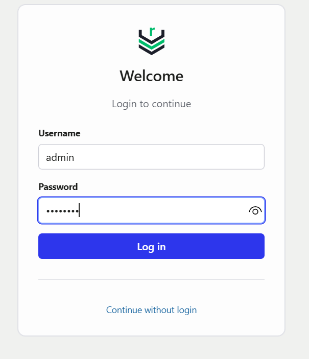
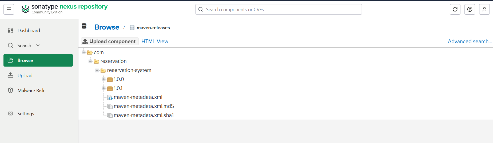
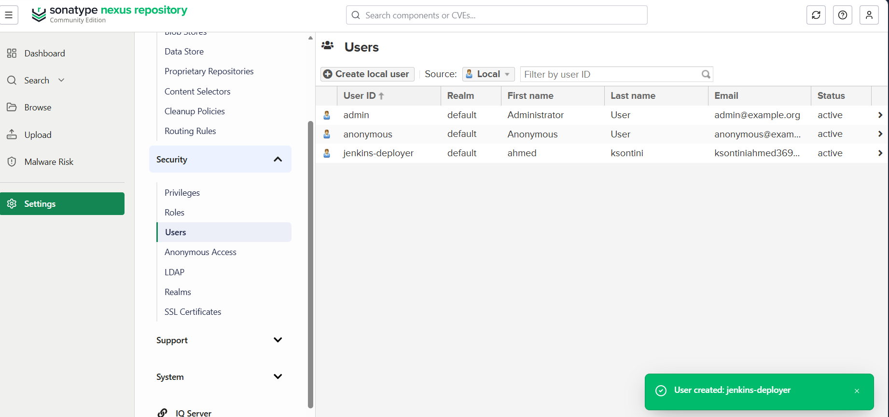
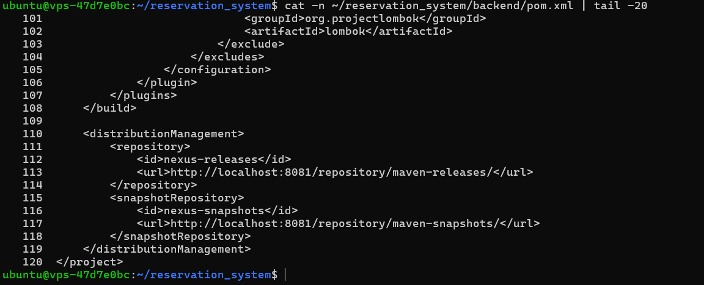
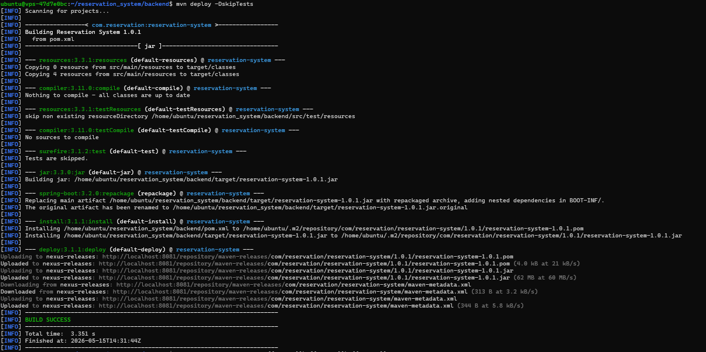
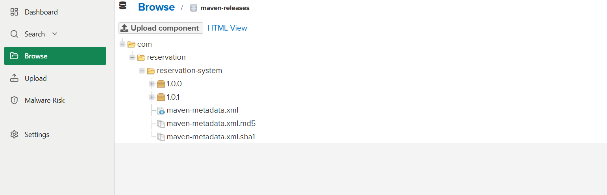
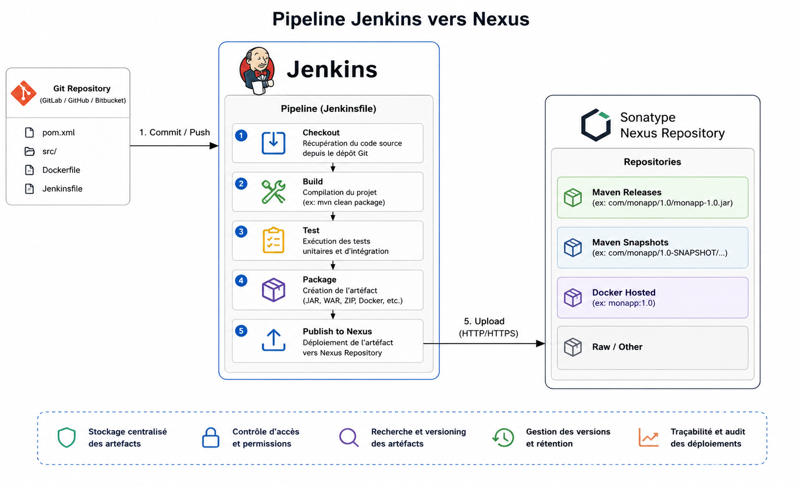

# LAB_NEXUS.md — Expert Artéfact : Sonatype Nexus Repository Manager

<p align="center">
  
</p>

<p align="center">
<b>Figure 1 — Architecture globale de la plateforme CI/CD</b>
</p>

> **Étudiant B — Pilier Artéfact**  
> Environnement : Ubuntu VPS · Docker · Maven · Spring Boot 1.0.1  
> Documentation officielle : https://help.sonatype.com/en/sonatype-nexus-repository.html

---

# 1. Le Besoin — Problématique Métier

## Pourquoi un dépôt privé d'artéfacts ?

Dans un projet professionnel, `mvn package` produit un fichier `.jar`.
Sans gestionnaire d’artéfacts, ce fichier :

- disparaît à la prochaine compilation,
- circule manuellement entre développeurs,
- n’est pas centralisé,
- peut être remplacé ou modifié sans contrôle,
- dépend d’Internet pour télécharger les dépendances.

Sonatype Nexus Repository Manager permet de résoudre ces problèmes.

| Problème sans Nexus | Solution avec Nexus |
|---|---|
| Pas de traçabilité des versions | Chaque artefact est versionné et horodaté |
| Rebuilds lents et dépendance Internet | Cache local des dépendances Maven |
| Partage manuel des JAR | URL centralisée et sécurisée |
| Difficulté de reproduction des builds | Artéfacts immuables et stockés |
| Dépendances externes non contrôlées | Proxy Maven Central et gestion des accès |

---

# 2. Les Concepts Clés

## 2.1 Hosted Repository

Un repository hosted stocke les artéfacts produits par l’équipe.

Exemples :

- `maven-releases`
- `maven-snapshots`

Dans ce laboratoire, nous utilisons `maven-releases` afin de publier les versions stables du projet `reservation-system`.

---

## 2.2 Proxy Repository

Un repository proxy agit comme un cache d’un dépôt distant.

Exemple :

- `maven-central`

Avantages :

- accélération des builds,
- réduction du trafic Internet,
- disponibilité locale des dépendances.

---

## 2.3 Group Repository

Un group repository regroupe plusieurs repositories sous une seule URL.

Exemple :

- `maven-public`

Cela simplifie la configuration Maven et Jenkins.

---

## 2.4 SNAPSHOT vs RELEASE

| Type | Description |
|---|---|
| `1.0.1-SNAPSHOT` | Version de développement modifiable |
| `1.0.1` | Version stable et immuable |

Le repository `maven-releases` est configuré avec la politique :

```text
Disable Redeploy
```

Une version RELEASE déjà publiée ne peut pas être écrasée.

---

## 2.5 Coordonnées Maven (GAV)

Chaque artefact Maven est identifié par :

```text
GroupId    : com.reservation
ArtifactId : reservation-system
Version    : 1.0.1
```

Chemin généré dans Nexus :

```text
com/reservation/reservation-system/1.0.1/
```

---

# 3. Mise en Place Technique

## 3.1 Déploiement Nexus avec Docker

Le déploiement a été réalisé sur un VPS Ubuntu via Docker.

Commande utilisée :

```bash
docker run -d \
  --name nexus \
  -p 8081:8081 \
  -v nexus-data:/nexus-data \
  sonatype/nexus3
```

---

## Vérification des conteneurs Docker

Commande :

```bash
docker ps --format "table {{.Names}}\t{{.Image}}\t{{.Ports}}"
```

<p align="center">
  
</p>

<p align="center">
<b>Figure 2 — Vérification des conteneurs Docker</b>
</p>

---

## Accès à Nexus

URL :

```text
http://SERVER_IP:8081
```

Récupération du mot de passe initial :

```bash
docker exec nexus cat /nexus-data/admin.password
```

<p align="center">
  
</p>

<p align="center">
<b>Figure 3 — Interface de connexion Nexus</b>
</p>

---

## 3.2 Création du Repository Hosted `maven-releases`

Dans l’interface Nexus :

1. Administration → Repositories
2. Create repository
3. Choisir `maven2 (hosted)`
4. Paramètres :

| Paramètre | Valeur |
|---|---|
| Name | `maven-releases` |
| Version policy | `Release` |
| Deployment policy | `Disable redeploy` |

URL du repository :

```text
http://SERVER_IP:8081/repository/maven-releases/
```

<p align="center">
  
</p>

<p align="center">
<b>Figure 4 — Repository Maven Hosted</b>
</p>

---

## 3.3 Création d’un utilisateur de déploiement

Le compte `admin` ne doit pas être utilisé dans les pipelines CI/CD.

Création d’un utilisateur dédié :

| Paramètre | Valeur |
|---|---|
| User ID | `jenkins-deployer` |
| Password | `********` |
| Role | `nx-deployment` |

<p align="center">
  
</p>

<p align="center">
<b>Figure 5 — Création de l’utilisateur Nexus</b>
</p>

---

## 3.4 Configuration Maven — settings.xml

Le fichier `settings.xml` permet à Maven d’utiliser les credentials Nexus.

Emplacement :

```text
~/.m2/settings.xml
```

Configuration utilisée :

```xml
<settings>
  <servers>
    <server>
      <id>nexus-releases</id>
      <username>jenkins-deployer</username>
      <password>********</password>
    </server>
  </servers>
</settings>
```

<p align="center">
  
</p>

<p align="center">
<b>Figure 6 — Configuration Maven settings.xml</b>
</p>

---

## 3.5 Configuration du pom.xml

Le projet Spring Boot doit déclarer le repository de déploiement.

```xml
<distributionManagement>
  <repository>
    <id>nexus-releases</id>
    <url>http://SERVER_IP:8081/repository/maven-releases/</url>
  </repository>
</distributionManagement>
```

<p align="center">
  
</p>

<p align="center">
<b>Figure 7 — Configuration distributionManagement dans pom.xml</b>
</p>

---

## 3.6 Build Maven

Build du projet backend :

```bash
cd reservation_system/backend
mvn clean package
```

Résultat obtenu :

```text
[INFO] BUILD SUCCESS
```

L’artefact généré :

```text
target/reservation-system-1.0.1.jar
```

<p align="center">
  
</p>

<p align="center">
<b>Figure 8 — Build Maven réussi</b>
</p>

---

## 3.7 Déploiement de l’artefact dans Nexus

Commande utilisée :

```bash
mvn deploy -DskipTests
```

Résultat observé :

```text
Uploading to nexus-releases...
Uploaded to nexus-releases...
[INFO] BUILD SUCCESS
```

<p align="center">
  
</p>

<p align="center">
<b>Figure 9 — Déploiement Maven réussi</b>
</p>

---

# 4. Test et Validation

## 4.1 Vérification dans l’interface Nexus

Depuis :

```text
Browse → maven-releases
```

Structure obtenue :

```text
com/
 └── reservation/
      └── reservation-system/
           └── 1.0.1/
```

<p align="center">
  
</p>

<p align="center">
<b>Figure 10 — Artefact publié dans Nexus</b>
</p>

---

## 4.2 Ce que les résultats prouvent

Les tests réalisés démontrent :

- Nexus Repository OSS fonctionne correctement,
- le repository Maven Hosted est opérationnel,
- Maven peut publier des artefacts sur Nexus,
- les versions sont stockées et versionnées,
- le repository est prêt pour une intégration CI/CD.

---

## 4.3 Scénario d’échec — Disable Redeploy

Une tentative de re-déploiement de la version `1.0.1` retourne :

```text
400 Repository does not allow updating assets
```

Ce comportement garantit l’immuabilité des releases.

La solution consiste à incrémenter la version :

```text
1.0.2
```

---

# 5. Intégration Jenkins → Nexus (Semaine 2)

Cette partie sera réalisée durant la semaine 2.

Objectif :

1. Build Maven automatique
2. Analyse SonarQube
3. Validation du Quality Gate
4. Publication automatique dans Nexus

Pipeline cible :

```text
Git Push
    ↓
Jenkins Pipeline
    ↓
Build Maven
    ↓
Quality Gate SonarQube
    ↓
Publish Artifact → Nexus
```

<p align="center">
  
</p>

<p align="center">
<b>Figure 11 — Pipeline Jenkins vers Nexus</b>
</p>

---

# 6. Sécurité

Mesures appliquées :

- désactivation des accès anonymes,
- utilisateur dédié au déploiement,
- séparation des rôles,
- credentials Maven stockés dans `settings.xml`,
- future gestion des secrets via Jenkins Credentials.

---

# 7. Conclusion

Ce laboratoire nous a permis de comprendre le rôle d’un gestionnaire d’artéfacts dans une architecture CI/CD moderne.

Nous avons appris à :

- déployer Nexus Repository OSS,
- configurer des repositories Maven,
- gérer des utilisateurs et permissions,
- générer un artefact Maven,
- publier un `.jar` dans Nexus,
- préparer l’intégration Jenkins → Nexus.

Cette étape constitue la base de la chaîne CI/CD qui sera finalisée durant la semaine 2.

---

# 8. Références Officielles

| Sujet | Documentation |
|---|---|
| Nexus Repository OSS | https://help.sonatype.com/en/sonatype-nexus-repository.html |
| Installation Docker | https://help.sonatype.com/en/docker-container-configuration.html |
| Hosted Repositories | https://help.sonatype.com/en/hosted-repositories.html |
| Maven Deploy Plugin | https://maven.apache.org/plugins/maven-deploy-plugin/ |
| Jenkins Documentation | https://www.jenkins.io/doc/ |
| Docker Documentation | https://docs.docker.com/ |

