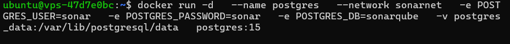
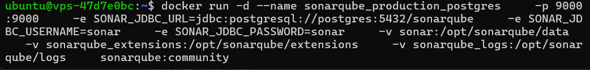
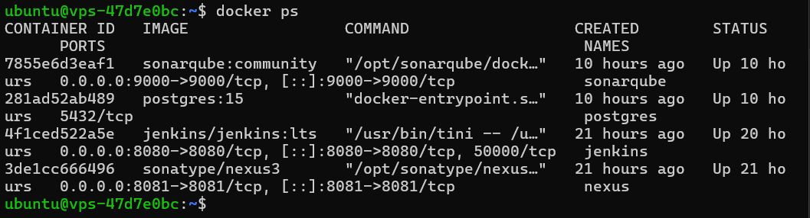
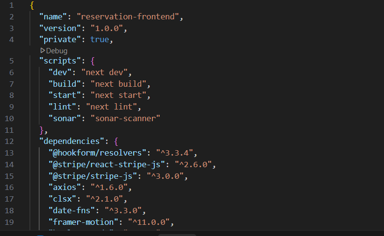
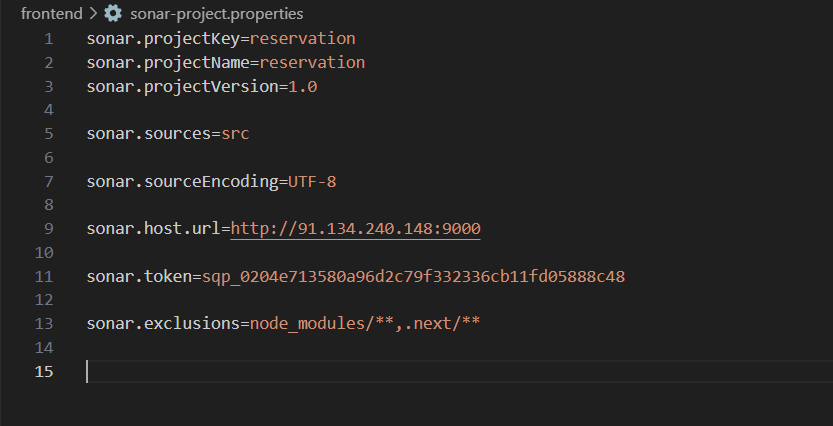
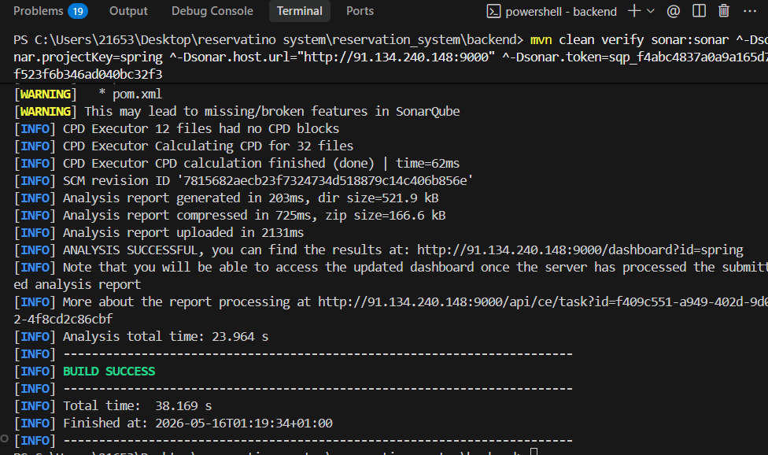

# LAB_SONARQUBE.md — Enterprise Code Quality & Security Governance with SonarQube

> Developer Lab — Code Quality & Secure SDLC Pillar  
> Environment: Ubuntu VPS · Docker · PostgreSQL · Next.js · Spring Boot · npm · Maven

---

# 0. Introduction

Modern software engineering is no longer only about delivering features quickly.

Large-scale applications require:

- code quality governance,
- security enforcement,
- maintainability tracking,
- technical debt management,
- CI/CD quality gates,
- automated static analysis.

SonarQube solves this by introducing automated code inspection and quality governance into the software delivery lifecycle.

---

# 1. SonarQube Architecture Overview

```text
                        ┌────────────────────────────┐
                        │        Developer / CI      │
                        │  npm / Maven / Gradle      │
                        │   sonar-scanner CLI        │
                        └─────────────┬──────────────┘
                                      │
                                      ▼
┌──────────────────────────────────────────────────────────────────┐
│                      SONARQUBE SERVER                            │
│                                                                  │
│  ┌─────────────────┐  ┌─────────────────┐  ┌─────────────────┐  │
│  │   Web Server    │  │ Compute Engine  │  │ Elasticsearch   │  │
│  │ - REST API      │  │ - Rule eval     │  │ - Fast search   │  │
│  │ - UI Dashboard  │  │ - Metrics calc  │  │ - Indexing      │  │
│  │ - Quality Gates │  │ - Async tasks   │  │ - Filtering     │  │
│  └────────┬────────┘  └────────┬────────┘  └─────────────────┘  │
└───────────┼────────────────────┼──────────────────────────────────┘
            │ SQL
            ▼
┌───────────────────────────────────────────┐
│           PostgreSQL Database             │
│ Projects · Issues · Metrics · Rules       │
└───────────────────────────────────────────┘
```

---

# 2. Why SonarQube Exists

Without centralized code governance:

- bugs reach production,
- vulnerabilities remain invisible,
- technical debt grows silently,
- maintainability decreases,
- teams lose quality visibility.

| Problem Without SonarQube | Solution With SonarQube |
|---|---|
| Bugs found in production | Static analysis before merge |
| No security visibility | Vulnerability detection |
| No maintainability metrics | Code Smells tracking |
| Technical debt invisible | Debt estimation |
| No CI enforcement | Quality Gates |

---

# 3. Before SonarQube

Before SonarQube, quality tooling was fragmented.

| Problem | Old Tool |
|---|---|
| Java style checks | Checkstyle |
| Bug detection | FindBugs |
| PMD rules | PMD |
| Duplication detection | CPD |
| Coverage | Cobertura |
| Security scanning | Fortify |

Early Sonar acted mainly as a dashboard wrapper aggregating reports from external tools before evolving into a complete native static analysis platform.
### SonarSource: Founded 2008
 
SonarQube (originally just "Sonar") was created by **Olivier Gaudin, Freddy Mallet, and Simon Brandhof** and released as open source in 2007/2008. The founding insight was deceptively simple:
 
> *"Build a single, unified platform that aggregates quality metrics from multiple analyzers, persists them in a database, and presents a developer-friendly web dashboard with historical trends."*
 
This was not about building the best analyzer. It was about building the best **platform for quality data**.
 
### The Original Architecture (Sonar 1.x)
 
The original Sonar was a Maven plugin. Analysis happened inside the Maven build:
 
```
mvn sonar:sonar
    │
    ├── Runs PMD analysis
    ├── Runs Checkstyle analysis
    ├── Runs FindBugs analysis
    ├── Collects JaCoCo coverage
    └── POSTs all results to Sonar server
              │
              └── Sonar server stores in MySQL
                        │
                        └── Web dashboard renders metrics
```
 
This was brilliant because it **leveraged existing tools** rather than replacing them. Sonar was an aggregation and persistence layer with a great UI.
 
### Evolution: Sonar → SonarQube
 
| Version | Year | Major Changes |
|---------|------|---------------|
| Sonar 1.x | 2008 | Maven plugin, MySQL only, basic metrics |
| Sonar 2.x | 2010 | Plugin architecture, multi-language |
| Sonar 3.x | 2012 | Quality gates, issues workflow |
| SonarQube 4.x | 2014 | Rebrand, new scanner architecture, Elasticsearch |
| SonarQube 5.x | 2015 | Branch analysis, DevOps integration |
| SonarQube 6.x | 2016–17 | New UI, security rules, PR analysis |
| SonarQube 7.x | 2018 | Security hotspots, taint analysis |
| SonarQube 8.x | 2019–21 | New code focus, branch analysis improvements |
| SonarQube 9.x | 2021–23 | Clean as You Code, JRE bundled |
| SonarQube 10.x | 2023+ | Renamed editions, improved security engine |
 
### The Critical Architecture Shift: SonarQube 4.x
 
The most important architectural change happened in **version 4.x** when SonarQube moved from embedded analysis (in Maven) to a **standalone scanner model**:
 
```
OLD (pre-4.x):
Developer runs: mvn sonar:sonar
    └── Analysis happens INSIDE Maven JVM
    └── Results sent to server
 
NEW (4.x+):
Developer/CI runs: sonar-scanner
    └── Scanner is SEPARATE process
    └── Scanner sends raw data to server
    └── SERVER processes analysis asynchronously (Compute Engine)
    └── Elasticsearch used for search/indexing
```
 
This was a fundamental shift that enabled:
1. **Language independence**: scanners no longer tied to Maven/Java ecosystem
2. **Async processing**: server not blocked during analysis
3. **Horizontal scaling**: multiple scanner workers possible
4. **Better resource isolation**: scanner memory doesn't affect server
### Why DevOps Turbocharged SonarQube Adoption
 
The DevOps movement (2009–2015) changed everything. When teams started running CI/CD pipelines for every commit, they needed automated quality gates. SonarQube was perfectly positioned:
 
```
DevOps Requirement         SonarQube Feature
─────────────────────────────────────────────────────
"Every commit triggers CI" → Scanner runs in CI pipeline
"Automate quality checks"  → Quality Gates
"Block bad code"           → Gate failure = pipeline failure
"Developer feedback loop"  → PR decoration with inline comments
"Track improvement"        → Historical metrics dashboard
"Security in pipeline"     → SAST in CI ("shift left")
```
 
---
 
# WHAT EXACTLY IS SONARQUBE? 
 
##  Formal Definitions
 
**Formal definition:** SonarQube is a continuous inspection platform that performs static analysis of source code to detect bugs, security vulnerabilities, code smells, and duplication, persisting metrics historically and enforcing quality gates in CI/CD pipelines.
 
**Technical definition:** SonarQube is a server-based static application security testing (SAST) and code quality management system comprising a multi-component server (web server, compute engine, Elasticsearch), an external relational database, and distributed language-specific scanners that communicate via REST API, processing source code through AST-based rule engines to produce structured issue and metric data.
 
**DevOps definition:** SonarQube is the quality gate in your CI/CD pipeline — the automated enforcement layer that prevents code that violates quality or security standards from advancing through deployment stages.
 
**AppSec definition:** SonarQube is a SAST tool that performs inter-procedural taint analysis, detects injection vulnerabilities, secret exposure, insecure cryptographic usage, and maps findings to OWASP Top 10, CWE, SANS Top 25, and PCI-DSS requirements.
 
**Enterprise governance definition:** SonarQube is a centralized code quality governance platform providing portfolio-level visibility into technical debt, security posture, and quality trends across hundreds of projects, enabling policy enforcement, compliance reporting, and developer accountability at scale.

---

# 4. Internal Evaluation Model

SonarQube evaluates code using:

- parsers,
- ASTs (Abstract Syntax Trees),
- semantic analysis,
- rule engines,
- data-flow analysis,
- taint analysis.

Example:

```js
if (user = admin)
```

AST representation:

```text
        IF
       /  \
   ASSIGN  admin
    /  \
 user  admin
```

---

# 5. Issue Types

| Type | Definition |
|---|---|
| Bug | Incorrect code behavior |
| Vulnerability | Confirmed security exploit path |
| Code Smell | Maintainability problem |
| Security Hotspot | Security-sensitive code requiring review |

---

# 6. Code Smells

A Code Smell is not necessarily a bug.

It indicates future maintenance risks.

Common examples:

- Long methods
- Deep nesting
- Duplicate code
- Magic numbers
- God classes
- Dead code

---

# 7. Technical Debt

Technical debt represents future work caused by shortcuts taken today.

Examples:

| Issue | Estimated Debt |
|---|---|
| Rename variable | 2 min |
| Remove duplication | 15 min |
| Fix SQL injection | 30 min |

Debt Ratio:

```text
Debt Ratio = (Remediation Cost / Development Cost) × 100
```

---

# 8. Security Hotspots

Security Hotspots differ from vulnerabilities.

Examples:

- eval()
- Weak crypto
- Hardcoded tokens
- Wildcard CORS

Hotspots enforce manual security review culture.

---

# 9. Quality Gates

Quality Gates are automated pass/fail policies.

Example conditions:

- New Bugs = 0
- New Vulnerabilities = 0
- Coverage ≥ 80%
- Duplication ≤ 3%

CI/CD Flow:

```text
Build → Test → Sonar Analysis → Quality Gate
                                 │
                      PASS ──────┴──────► Deploy
                      FAIL ─────────────► Block Pipeline
```

---

# 10. Infrastructure Requirements

| Component | Requirement |
|---|---|
| Java | Required |
| PostgreSQL | Required in production |
| Elasticsearch | Embedded internally |
| Docker | Recommended |
| RAM | Minimum 2 GB |

---

# 11. Docker Deployment

Create Docker network:

```bash
docker network create sonar-net
```

Run PostgreSQL:

```bash
docker run -d \
  --name sonarqube-db \
  --network sonar-net \
  -e POSTGRES_DB=sonarqube \
  -e POSTGRES_USER=sonar \
  -e POSTGRES_PASSWORD=sonar \
  postgres:15-alpine
```


Run SonarQube:

```bash
docker run -d \
  --name sonarqube \
  --network sonar-net \
  -p 9000:9000 \
  -e SONAR_JDBC_URL=jdbc:postgresql://sonarqube-db:5432/sonarqube \
  -e SONAR_JDBC_USERNAME=sonar \
  -e SONAR_JDBC_PASSWORD=sonar \
  sonarqube:community
```






---

# 12. Scanner Integration

Install scanner locally:

```bash
npm install --save-dev sonarqube-scanner
```

package.json:

```json
{
  "scripts": {
    "sonar": "sonar-scanner"
  }
}
```

Run analysis:

```bash
npm run sonar 
```

Create a `sonar-project.properties` file in the root of your project with the following content:
```
# Root project information
sonar.projectKey=my-project-key
sonar.projectName=My Project
sonar.projectVersion=1.0

# Path to the source code
sonar.sources=.

# Exclusions
sonar.exclusions=**/node_modules/**,**/*.spec.js

#
```

---

# 13. Maven Integration

```bash
mvn clean verify sonar:sonar \
  -Dsonar.projectKey=my-spring-app \
  -Dsonar.host.url=http://YOUR_SERVER_IP:9000 \
  -Dsonar.token=YOUR_TOKEN
```

---

# 14. Production Best Practices

- Use PostgreSQL instead of H2
- Use HTTPS reverse proxy
- Persist Docker volumes
- Monitor Elasticsearch memory usage
- Backup PostgreSQL regularly
- Store tokens in CI secrets

---

# 15. Conclusion

SonarQube is an enterprise-grade:

- static analysis platform,
- security engine,
- technical debt tracker,
- CI/CD governance checkpoint,
- software quality management system.

It introduces automated code governance into the software delivery lifecycle.
